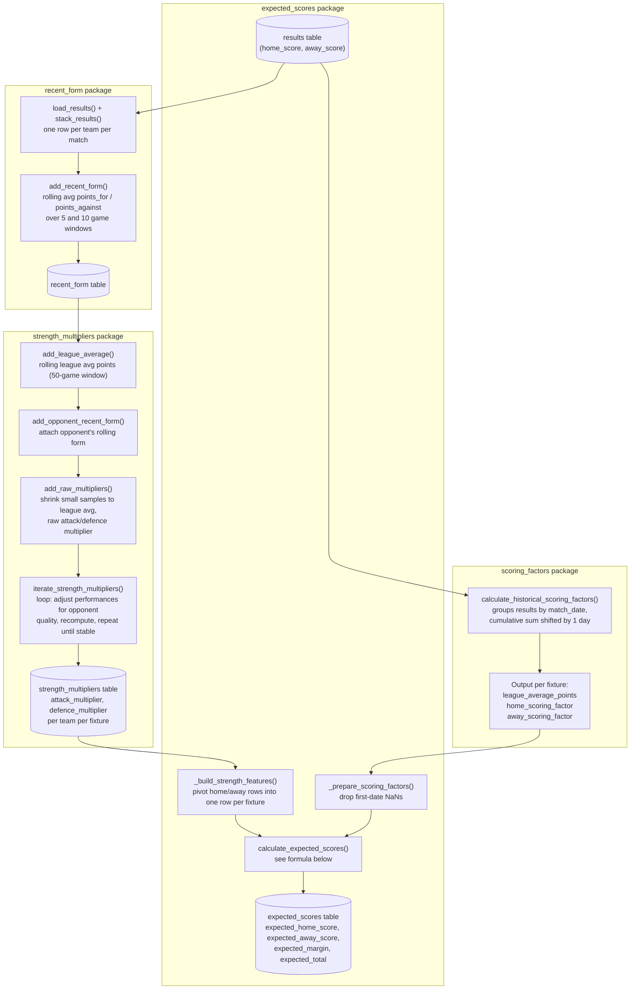

# Rugby League Pricing

A Python project for collecting rugby league data and building a rugby league pricing model.

Current focus:

- Super League data ingestion
- SQLite data storage
- Feature engineering
- Team strength modelling
- Match pricing

## Requirements

- Python 3.12
- uv
- SQLite

## Setup

```bash
uv sync
```

## Initialising the database

```bash
uv run python scripts/initialise_database.py
```

## Loading historical data

Results

```bash
uv run python scripts/results/rugby_league_project/ingest_results.py \
  --start-season 2010 \
  --end-season 2026
```

Fixtures

```bash
uv run python scripts/fixtures/rugby_league_project/ingest_fixtures.py \
  --start-season 2010 \
  --end-season 2026
```

## Feature pipeline: results → base expected score



Expected points formula (in [core.py](src/rugby_league_pricing/features/expected_scores/core.py)):

```text
expected_home_points = league_average_points
                        × home_attack_multiplier
                        × away_defence_multiplier
                        × home_scoring_factor

expected_away_points = league_average_points
                        × away_attack_multiplier
                        × home_defence_multiplier
                        × away_scoring_factor
```

Each expected score combines three independent signals: the league baseline, opponent-adjusted team strength (from `strength_multipliers`), and the venue scoring factor (from `scoring_factors`).

### Home/away scoring factors are the home-advantage effect

`home_scoring_factor` and `away_scoring_factor` are calculated purely from venue (home vs away), not per-team — every fixture on the same date receives the identical factor regardless of which two teams are playing. They capture the league-wide tendency for home teams to score more than away teams. Team-specific strength (who's actually good or bad at attack/defence) is handled separately by the opponent-adjusted `attack_multiplier`/`defence_multiplier` in the `strength_multipliers` package.

## Project structure

```text
.
├── data/
├── scripts/
├── src/
├── tests/
├── pyproject.toml
└── README.md
```

## Current functionality

- Scrape historical results
- Scrape fixtures
- Maintain canonical team mappings
- Store data in SQLite
- Build recent-form & expected scores features

## Roadmap

- Match pricing model
- Days since previous game
- Weather/Seasonality
- Player ratings
- Team news analysis
- Dashboard